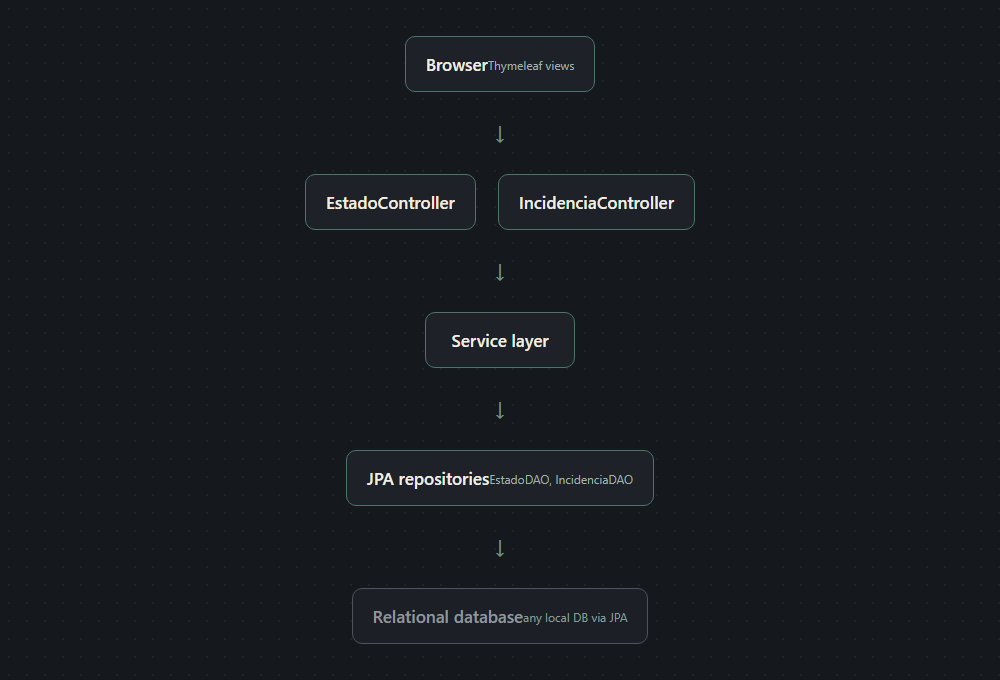

# Architecture

Built a server-rendered incident-tracking app — create, list, edit and close incidents, each tied
to a status — using Spring Boot, Spring Data JPA and Thymeleaf.

A user opens the incident list, adds a new incident with a title, description and priority, and
watches it get a status from a fixed set of options (open, in progress, closed and similar). Every
incident carries an opening timestamp and, once resolved, a closing timestamp — so the list also
serves as a basic history of how long things took to fix. Estado and Incidencia are managed on
separate screens but linked: each incident points at exactly one status.

**Why Spring Boot**: this is the framework the course teaches for Java web development, not an
independent architectural choice — it's a reasonable pick either way (huge ecosystem, generates
most of the CRUD boilerplate through Spring Data JPA), but the honest reason it's here is that it's
what was taught.

## A note on this template

The original repository was committed without its build file and without the standard Maven
folder layout (`src/main/java/...`), so this template ships the source as-is, cleaned up and
documented, **without a working build**. Two import statements had been cut off mid-line in the
original and are fixed here; nothing else about the logic was changed. If you want to run this,
the fastest path is regenerating a fresh Spring Boot project from
[start.spring.io](https://start.spring.io) with Web, Thymeleaf, Spring Data JPA and Lombok, then
dropping these packages into the generated `src/main/java/...` tree.

There is no REST API and no Swagger documentation in this template — the original project never
exposed one, and adding one for this template alone risked describing functionality that was
never actually built or tested. This is a documentation and cleanup pass, not a rewrite.

## Structure

| Package | What it does |
|---|---|
| `controller/` | `EstadoController`, `IncidenciaController` — handle HTTP requests, return
Thymeleaf view names. |
| `service/` | Business logic, one interface + implementation pair per entity. |
| `dao/` | `EstadoDAO`, `IncidenciaDAO` — Spring Data JPA repositories (`JpaRepository`), so most
CRUD is generated, not hand-written. |
| `domain/` | `Estado`, `Incidencia` — JPA entities. `Incidencia` holds a `@ManyToOne` to
`Estado`, so each incident carries one status. |
| `templates/` | Thymeleaf HTML views — list/add/edit pages for both entities, plus a login page. |

## Language / framework breakdown

| Part | Technology |
|---|---|
| Backend | Java + Spring Boot (MVC, not REST) |
| Data access | Spring Data JPA (`JpaRepository`) |
| Views | Thymeleaf server-rendered HTML |
| Boilerplate reduction | Lombok (`@Data` on entities) |

## Data and external services

Uses a relational database via JPA — the original datasource configuration wasn't part of what
was committed, so it isn't known which database it pointed at. Point it at any local database
(H2 file-based is the simplest option for a Spring Boot project with no other setup needed) via
`application.properties` once you've regenerated the project skeleton.

## Worth knowing before you build on this

The login check in `IncidenciaServiceImpl` compares against a hardcoded `"admin"` / `"admin"`
pair rather than looking up a user in the database — that's how the original was built, kept
as-is here rather than silently upgraded to real authentication, since a template should show
what was actually built.
