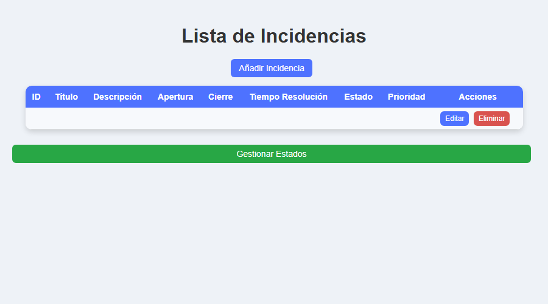

# Incidencia_Y_Estado [TEMPLATE]

A Spring Boot / Thymeleaf app for tracking incidents and their status.

## Showcase

*Real screenshot of the original `Incidencia-list.html` template, opened directly in a browser —
no Spring backend behind it, so the table is empty. It shows the actual UI that was built, not a
mockup.*

**This template is a documentation and cleanup pass, not a runnable build** — see
[ARCHITECTURE.md](./ARCHITECTURE.md) for why, and how to get it running.

## License

MIT — see [LICENSE](./LICENSE).
