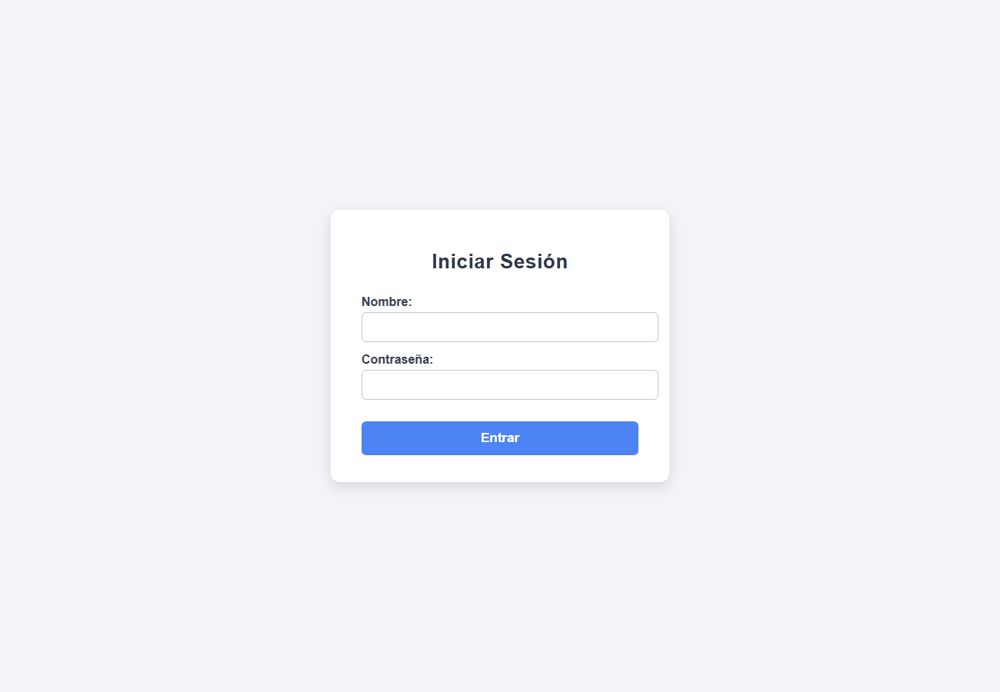
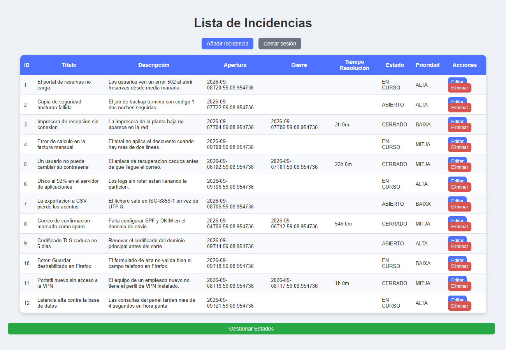
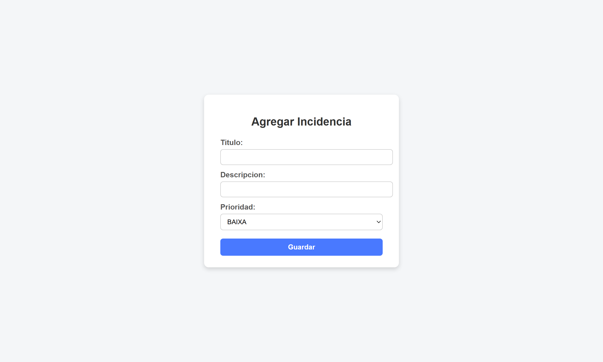
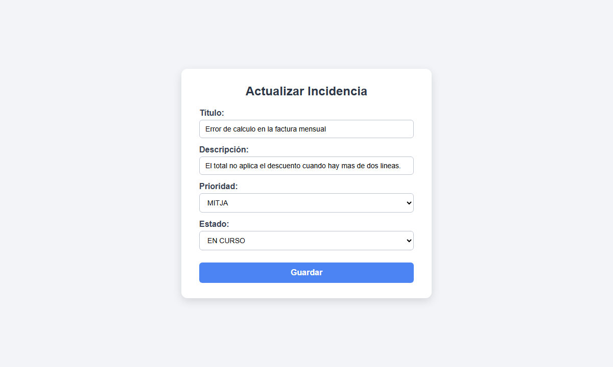
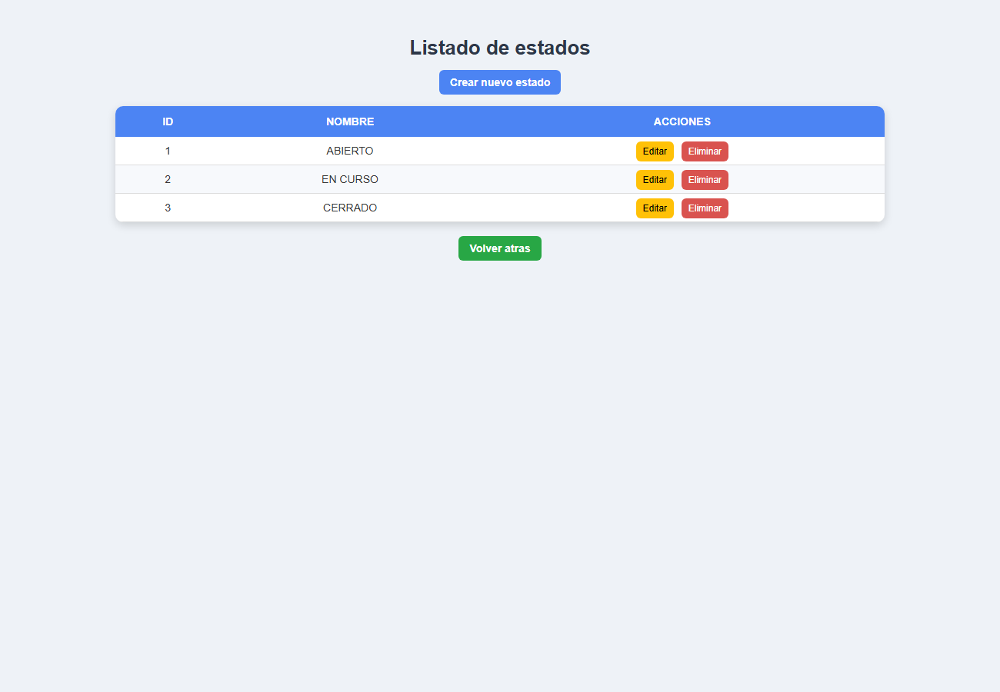

# incident-tracker


[](https://github.com/PresidenteOG/incident-tracker/actions/workflows/ci.yml)


A small internal tool for logging IT incidents and tracking their status. Log in, see every
incident with its priority and current status, add a new one, edit it, and mark it closed —
at which point the app records the close time and works out how long it was open. Statuses
(open, in progress, closed) are managed on their own screen and each incident points at one.

Server-rendered with Spring Boot and Thymeleaf, JPA over an in-memory H2 database. It runs
offline with nothing to configure — the database is created and filled with demo data every
time the app starts.

## Start here

If you only read one file, read
[`IncidenciaServiceImpl`](./src/main/java/com/dam/incidencias/service/IncidenciaServiceImpl.java).
`saveIncidencia` is where the one real decision lives: a new incident gets its opening time
stamped and defaults to *open*; an edit keeps the original opening time no matter what the
form sent; moving an incident to *closed* stamps the close time and works out how long it was
open (`"2h 30m"`), and moving it back off *closed* clears both. The matching test,
[`IncidenciaServiceImplTest`](./src/test/java/com/dam/incidencias/service/IncidenciaServiceImplTest.java),
pins each of those branches with the DAOs mocked. Everything else — controllers, the status
CRUD screen, the hardcoded login — is plain Spring MVC glue around that.

## Run it

```
git clone https://github.com/PresidenteOG/incident-tracker.git
cd incident-tracker
./mvnw spring-boot:run
```

Then open <http://localhost:8080> and log in:

| User | Password |
|---|---|
| `admin` | `admin` |

That is the only account — there is no user table, the check is against a hardcoded pair (see
`IncidenciaServiceImpl.checkLogin`). The incident list loads with a dozen invented incidents
spread across the three statuses and both open and closed, so every screen has data. The H2
console is at <http://localhost:8080/h2-console> (JDBC URL `jdbc:h2:mem:incidenciasdb`).

## Screenshots

From a local run on the seeded data.

 | 
:---:|:---:
Login (`admin` / `admin`) | Incident list, mixed statuses and priorities

 | 
:---:|:---:
Logging a new incident | Editing one — changing the status is what records the close time


:---:
The three statuses, managed on their own screen

## Tests

```
./mvnw verify
```

29 tests. The bulk are unit tests on the service layer with the DAOs mocked
(`IncidenciaServiceImplTest`, `EstadoServiceImplTest`) — no Spring context, fast. On top of
those a `@DataJpaTest` slice (`IncidenciaDAOTest`) runs the real JPA layer against H2 and
checks the seed loads and the `Incidencia → Estado` mapping resolves, and a `@SpringBootTest`
smoke test boots the whole context. JaCoCo runs in the `verify` phase; the coverage badges
above are regenerated from its report by CI on every push to `main`. Coverage is concentrated
on the service layer on purpose — the controllers are thin enough that a test would only
restate the mapping annotations.

## Architecture

Browser → controller → service → Spring Data JPA repository → H2. MVC, not REST; no JSON API.
[ARCHITECTURE.md](./ARCHITECTURE.md) walks through it and covers what was reconstructed to get
the project building again.

## License

PolyForm Noncommercial 1.0.0 — see [LICENSE](./LICENSE). Free to read, run and fork for
personal and non-commercial use.
