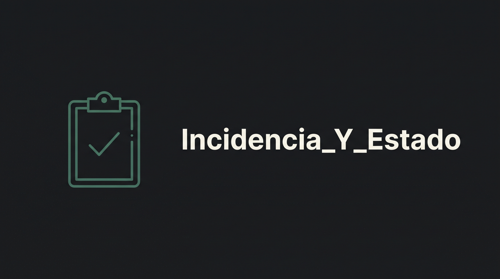

# incident-tracker


A small internal tool for logging IT incidents and tracking their status. Log in, see every
incident with its priority and current status, add a new one, edit it, and mark it closed —
at which point the app records the close time and works out how long it was open. Statuses
(open, in progress, closed) are managed on their own screen and each incident points at one.

Server-rendered with Spring Boot and Thymeleaf, JPA over an in-memory H2 database. It runs
offline with nothing to configure — the database is created and filled with demo data every
time the app starts.

## Run it

```
git clone https://github.com/PresidenteOG/incident-tracker.git
cd incident-tracker
./mvnw spring-boot:run
```

Then open <http://localhost:8080> and log in:

| User | Password |
|---|---|
| `admin` | `admin` |

That is the only account — there is no user table, the check is against a hardcoded pair (see
`IncidenciaServiceImpl.checkLogin`). The incident list loads with a dozen invented incidents
spread across the three statuses and both open and closed, so every screen has data. The H2
console is at <http://localhost:8080/h2-console> (JDBC URL `jdbc:h2:mem:incidenciasdb`).

## Screenshots

 | 
:---:|:---:
Login | Incident list

 | 
:---:|:---:
New incident | Statuses

## Architecture

Browser → controller → service → Spring Data JPA repository → H2. MVC, not REST; no JSON API.
[ARCHITECTURE.md](./ARCHITECTURE.md) walks through it and covers what was reconstructed to get
the project building again.

## License

PolyForm Noncommercial 1.0.0 — see [LICENSE](./LICENSE). Free to read, run and fork for
personal and non-commercial use.
